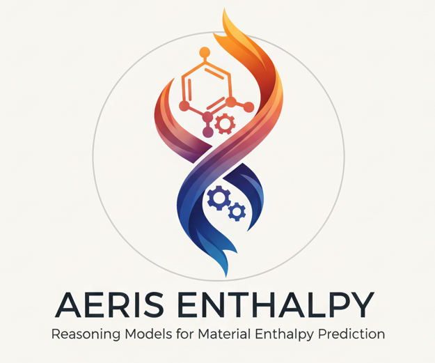

# AERIS, an agentic framework for material enthalpy prediction



AERIS Enthalpy is an AI system designed to assess complex nuclear fuel behavior and help scientists predict how fuels will perform inside a reactor before they are built.

AERIS features an interactive orchestration framework that empowers scientists to test hypotheses and drive the discovery of new materials in real-time. By acting as a collaborative partner rather than a passive prediction tool, AERIS enables researchers to engage directly with the AI to query complex datasets, generate candidates, and trigger automated simulations via external agents.

AERIS can be installed as a stand alone library, with the codes executed birectly through function calls or
can be connected to reasoning models through MCP tools or Claude SKILLs.

## AERIS as a stand alone library


## AERIS through MCP tools

### MCP tools

There are currently 4 mcp tools to interact with the reasoning model:

**1) Tool to find existing structures for a given composition by looking in available datasets**
```
> Find existing structures for UO2
[] None found

> Find existing structures for Ag8Bi4O12 and show me only the first 2 finds
[
  {
    "source_file": "Dataset_feature+CN.csv",
    "material_id": "mp-23558",
    "composition": "Ag8 Bi4 O12",
    "formula_anonymous": "AB2C3",
    "spacegroup_number": 34,
    "nsites": 24,
    "e_total": 26.531189300000005,
    "structure_preview": "Full Formula (Ag8 Bi4 O12)\nReduced Formula: Ag2BiO3\nabc   :   6.063333   6.285707   9.618193\nangles:  90.000000  90.000000  90.000000\npbc   :       True       True       True\nSites (24)\n  #  SP            a         b         c    magmom\n---  ----  ---------  --------  --------  --------\n  0  Ag     0.970236  0.752254  0.252227        -0\n  1  Ag     0.746126  0.000762  0.495417        -0\n  2  Ag     0.246126  0.499238  0.995417        -0\n  3  Ag     0.753874  0.500762  0.995417        -0\n  4  Ag     0.529764  0.252254  0.752227        -0\n  5  Ag     0.470236  0.747746  0.752227        -0\n  6  Ag     0.029764  0.247746  0.252227        -0\n  7  Ag     0.253874  0.999238  0.495417        -0\n  8  Bi    -0         0         0.897572        -0\n  9  Bi     0.5       0.5       0.397572        -0\n 1"
  },
  {
    "source_file": "Dataset_feature+CN.csv",
    "material_id": "mp-558712",
    "composition": "Ag8 Bi4 O12",
    "formula_anonymous": "AB2C3",
    "spacegroup_number": 52,
    "nsites": 24,
    "e_total": NaN,
    "structure_preview": "Full Formula (Ag8 Bi4 O12)\nReduced Formula: Ag2BiO3\nabc   :   6.135074   6.332451   9.849262\nangles:  90.000000  90.000000  90.000000\npbc   :       True       True       True\nSites (24)\n  #  SP           a         b         c    magmom\n---  ----  --------  --------  --------  --------\n  0  Ag    0.722294  0.75      0.25             0\n  1  Ag    0.5       0         0.5              0\n  2  Ag    0.222294  0.75      0.75             0\n  3  Ag    0.777706  0.25      0.25             0\n  4  Ag    0         0         0.5              0\n  5  Ag    0.277706  0.25      0.75             0\n  6  Ag    0         0.5       0                0\n  7  Ag    0.5       0.5       0                0\n  8  Bi    0.25      0.5       0.395928        -0\n  9  Bi    0.75      0.5       0.604072        -0\n 10  Bi    0.7"
  }
]

```

**2) Tool to find candidate templates based on a given composition**

```
> Find candidate templates for UO2
  {
    "composition": "AB2",
    "structure": "Full Formula (Ag4 O2)\nReduced Formula: Ag2O\nabc   :   4.753991   4.753991   4.753991\nangles:  90.000000  90.000000  90.000000\npbc   :       True       True       True\nSites (6)\n  #  SP        a     b      c    magmom\n---  ----  -----  ----  -----  --------\n  0  Ag     0.5   0.5   -0           -0\n  1  Ag    -0     0.5    0.5         -0\n  2  Ag     0.5   0      0.5         -0\n  3  Ag    -0     0      0           -0\n  4  O      0.25  0.25   0.25         0\n  5  O      0.75  0.75   0.75         0",
    "spacegroup_number": 224,
    "density_atomic": 17.90703719814166,
    "CN_max": 4,
    "CN_min": 2,
    "CN_avg": 2.6666666666666665
  }
...
```

**3) Tool to predict the total enthalpy for a given composition**

```
> What is the energy prediction for UO2?
{
  "found_in_data": false,
  "source": "model",
  "per_atom_eV_per_atom": -2.848029851913452,
  "total_eV": -8.544089555740356,
  "parsed_composition": {
    "U": 1.0,
    "O": 2.0
  },
  "device": "cpu"
}
```

**4) Tool to predict the total enthalpy for a given composition and a structure**

```
> Predict the energy of UO2 with the structure:
{
"composition": "AB2",
"structure": "Full Formula (Ag4 O2)\nReduced Formula: Ag2O\nabc : 4.753991 4.753991 4.753991\nangles: 90.000000 90.000000 90.000000\npbc : True True
True\nSites (6)\n # SP a b c magmom\n--- ---- ----- ---- ----- --------\n 0 Ag 0.5 0.5 -0 -0\n 1 Ag -0 0.5 0.5 -0\n
2 Ag 0.5 0 0.5 -0\n 3 Ag -0 0 0 -0\n 4 O 0.25 0.25 0.25 0\n 5 O 0.75 0.75 0.75 0",
"spacegroup_number": 224,
"density_atomic": 17.90703719814166,
"CN_max": 4,
"CN_min": 2,
"CN_avg": 2.6666666666666665
}

{
  "per_atom_eV_per_atom": 43.331417083740234,
  "total_eV": 129.9942512512207
}
```
